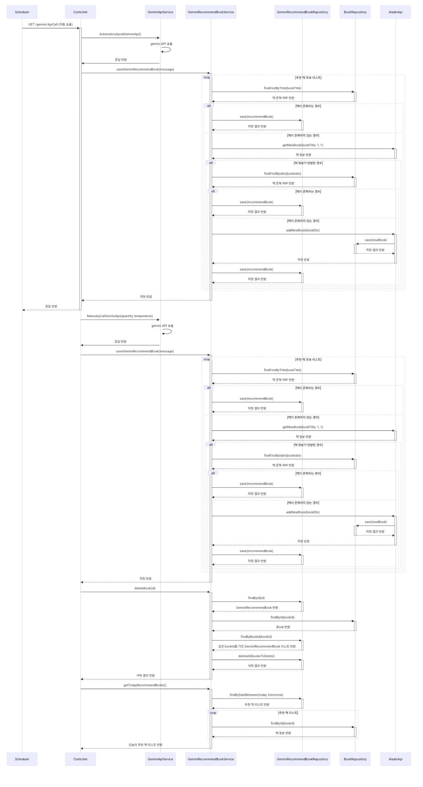
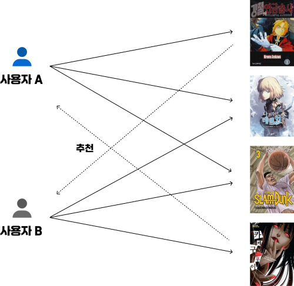

# 🖥 프로젝트 명 '오늘의 책'

### 목차
- [1. 프로젝트 소개](#1-프로젝트-소개)
- [2. 개발 인원 및 역할](#2-개발-인원-및-역할)
- [3. 프로젝트 일정](#3-프로젝트-일정)
- [4. 기술 스택](#4-기술스택)
- [5. 개발 일정](#5-개발-일정)
- [6. 아키텍처 설계도](#6-아키텍처-설계도)
- [7. DB 구성도](#7-DB-구성도)
- [8. 플로우 차트](#8-Flow-Chart)
- [9. 요구사항 및 기능 명세](#9-요구사항-및-기능명세)
- [10. API 명세서](#10-API-명세서)
- [11. UI](#11-UI)
- [12. 주요 기능](#12-주요-기능)
- [13. 프로젝트 구조](#13-프로젝트-구조)


# 1. 프로젝트 소개

오늘의 책은 책을 사랑하는 사람들을 위한 새로운 e-커머스 플랫폼입니다.<br>
평소에 좋아하던 책들을 공유하고, 다른 사람들 혹은 AI의 추천을 받아보며 새로운 책을 발견해보세요!

<br><br>
[클릭하여 페이지를 방문하세요](http://43.203.7.96:8080/)
<br><br>
[프로젝트 시연 영상 보러가기](https://drive.google.com/file/d/1UKE7NmfaBCsVVEPXpFwitNbQyLT4Krya/view)
<br><br>

# 2. 개발 인원 및 역할

<table style="width: 100%;">
<tr>
    <td align="center" style="width: 25%;"><a href="https://github.com/fernandokkang"></a></td>
    <td align="center" style="width: 25%;"><a href="https://github.com/dhktjr0204"></a></td>
    <td align="center" style="width: 25%;"><a href="https://github.com/kumacooma"></a></td>
</tr>
<tr>
    <td align="center"><a href="https://github.com/fernandokkang"><b>강성훈</b></a></td>
    <td align="center"><a href="https://github.com/dhktjr0204"><b>정지원</b></a></td>
    <td align="center"><a href="https://github.com/kumacooma"><b>이도훈</b></a></td>
</tr>
<tr>
    <td align="center">팀장</td>
    <td align="center">팀원</td>
    <td align="center">팀원</td>
</tr>
<tr> 
    <td align="center">Backend, Front</td>
    <td align="center">Backend</td>
    <td align="center">Backend</td>
</tr> 
<tr> 
    <td align="center">프로젝트 관리<br>프로젝트 발표<br>ERD 설계<br>aladin API를 이용한 책 데이터 수집 및 정제<br>UI/UX 디자인<br>디자인 파일 html 템플릿화<br>책 상세 정보 API<br>리뷰 작성 API<br>리뷰 추천/비추천 API<br>책 찜하기 API<br>아이템 기반 추천 시스템 설계<br>현재 책 기준 추천 책 제공 API<br>내가 찜한 책 기준 추천 책 제공 API<br>주문 내역 관리 API<br>매출 관리 API<br>차트를 통한 매출 시각화<br>테스트 코드 작성</td>
    <td align="center">ERD 설계<br>aladin api를 이용한 책 데이터 수집 및 정제<br>책 추천 리스트 API<br>추천 리스트 북마크 API<br>책 정렬 API<br>책 장르별 조회 API<br>책, 리스트 검색 API<br>주문 내역 및 배송 조회 API<br>유저 관리 API<br>알라딘 API 활용 신간 등록 API<br>배송 관리 API<br>책 수량 변경 및 수정 관리 API<br>JavaScript 개발(관리자, 추천 리스트,<br> 페이징, 검색)<br>테스트 코드 작성<br>리드미 작성<br>플로우 차트 작성<br>요구사항 명세서 작성<br>프로젝트 배포</td>
    <td align="center">장바구니 API 개발<br>장바구니 추가 및 삭제API<br>상품 수량 증감 조절 API<br>마일리지 등급별 차등적용 API<br>JavaScript(주문금액,배송료,마일리지,<br>총 결제금액 계산로직 및 실시간 업데이트)<br>리드미 작성</td>
</tr> 
</table>
<table style="width: 100%;">
<tr>
    <td align="center" style="width: 25%;"><a href="https://github.com/JuwoenLee"></a></td>
    <td align="center" style="width: 25%;"><a href="https://github.com/udidcs"></a></td>    
    <td align="center" style="width: 25%;"><a href="https://github.com/BaxDailyGit"></a></td>
</tr>
<tr>
    <td align="center"><a href="https://github.com/JuwoenLee"><b>이주원</b></a></td>
    <td align="center"><a href="https://github.com/udidcs"><b>변재정</b></a></td>
    <td align="center"><a href="https://github.com/BaxDailyGit"><b>백승진</b></a></td>
</tr>
<tr>
    <td align="center">팀원</td>
    <td align="center">팀원</td>
    <td align="center">팀원</td>
</tr>
<tr>
    <td align="center">Backend</td>
    <td align="center">Backend</td>
    <td align="center">Backend, Front</td>
</tr> 
<tr> 
    <td align="center">로그인 API 개발<br>회원 가입 API 개발<br>회원 탈퇴 API 개발<br>닉네임 수정 API 개발<br>주소 수정 API 개발<br>비밀번호 수정 API 개발<br>회원 정보 제공 API 개발<br>카카오맵 API 연동<br>Spring Security<br>JavaScript 개발 (로그인, 회원가입, 닉네임 수정,<br>주소 수정, 비밀번호 수정, 회원 탈퇴, 배송 정보 회원 동일,<br>카카오맵)
API 명세서 작성<br>
시연 영상 제작</td>
    <td align="center">결제 API연동<br>API 연동을 위해 개발 회사에 질의 응답<br>결제 후 주문 생성 로직 작성<br>결제 페이지 자바스크립트 작성<br>세션을 활용한 데이터 전달<br>결제 페이지 정보 유지 오류 해결을 위한 html, css조작</td>
    <td align="center">ERD 설계<br>Alan API 활용 SSE 실시간 채팅 API<br>Alan 챗봇 동적 채팅 UI<br>Alan 초기화 API 연동<br>Gemini API 활용 스케줄링 자동/수동 책 추천 및 배치 작업<br>Gemini 추천 책 조회 및 관리 API<br>Gemini 추천 책 관리자 페이지 UI<br>알라딘 API 활용 책 정보 검색 및 저장<br></td>
</tr> 
</table>

<div align="right">

[맨 위로](#목차)

</div>

<br>

# 3. 프로젝트 일정

2024/04/24(수) ~ 2024/05/16(목)

<br>

# 4. 기술스택

### [기술 - FE]

  

### [기술 - BE]

  

### [기술 - DB]

 

### [기술 - Data Analysis]


### [기술 - AI]

 

### [개발 - DEPLOY]

    

### [협업 도구]

        

<div align="right">

[맨 위로](#목차)

</div>

<br>

# 5. 개발 일정


<br>

# 6. 아키텍처 설계도


<div align="right">

[맨 위로](#목차)

</div>

<br>

# 7. DB 구성도


# 8. Flow Chart


<div align="right">

[맨 위로](#목차)

</div>

# 9. 요구사항 및 기능명세


# 10. API 명세서

## Admin
| URL                               | HTTP Method | 설명               |   로그인 권한 필요   |  작성자 권한 필요  | Admin 권한 
|-----------------------------------|-------------|------------------|:-------------:|:-----------:|:--------:|
| '/admin/userlist'                 | GET         | 회원 목록 조회         |       ✅       |             |     ✅     |
| '/admin/userlist/search'          | GET         | 회원 목록 검색         |       ✅       |             |     ✅     |
| '/admin/userlist'                 | PUT         | 회원 등급 수정         |       ✅       |             |     ✅     |
| '/admin/userlist'                 | DELETE      | 회원 삭제            |       ✅       |             |     ✅     |
| '/admin/stocklist'                | GET         | 책 재고 목록 조회       |       ✅       |             |     ✅     |
| '/admin/stocklist/search'         | GET         | 책 재고 검색          |       ✅       |             |     ✅     |
| '/admin/stocklist/sold-out'       | GET         | 책 재고 품절 목록 조회    |       ✅       |             |     ✅     |
| '/admin/stocklist'                | PUT         | 책 재고 수정          |       ✅       |             |     ✅     |
| '/admin/stocklist'                | DELETE      | 책 삭제             |       ✅       |             |     ✅     |
| '/admin/booklist'                 | GET         | 전체 책 목록 조회       |       ✅       |             |     ✅     |
| '/admin/booklist/search'          | GET         | 전체 책 목록 검색       |       ✅       |             |     ✅     |
| '/admin/booklist/edit'            | GET         | 책 정보 수정 페이지      |       ✅       |             |     ✅     |
| '/admin/booklist/edit'            | PUT         | 책 정보 수정          |       ✅       |             |     ✅     |
| '/admin/book_registration'        | GET         | 신간 등록 페이지        |       ✅       |             |     ✅     |
| '/admin/book_registration/search' | GET         | 신간 검색            |       ✅       |             |     ✅     |
| '/admin/book_registration'        | PUT         | 신간 등록            |       ✅       |             |     ✅     |
| '/admin/sync'                     | GET         | 추천 정보 동기화        |       ✅       |             |     ✅     |
| '/admin/sales'                    | GET         | 매출 관리 페이지        |       ✅       |             |     ✅     |
| '/admin/sales_category'           | GET         | 카테고리 별 매출 관리 페이지 |       ✅       |             |     ✅     |
| '/admin/sales_book'               | GET         | 책 별 매출 관리 페이지    |       ✅       |             |     ✅     |
| '/admin/order'                    | GET         | 주문 목록 조회         |       ✅       |             |     ✅     |
| '/admin/order/{id}'               | GET         | 주문 상세 조회         |       ✅       |             |     ✅     |
| '/admin/delivery'                 | GET         | 배송 목록 조회         |       ✅       |             |     ✅     |
| '/admin/delivery/search'          | GET         | 배송 검색            |       ✅       |             |     ✅     |
| '/admin/delivery'                 | PUT         | 배송 상태 수정         |       ✅       |             |     ✅     |
| '/admin/updateinfo'               | GET         | 관리자 정보 수정 페이지    |       ✅       |       ✅      |     ✅     |
| '/admin/updatepw'                 | GET         | 관리자 비밀번호 변경 페이지  |       ✅       |       ✅      |     ✅     |
| '/admin/gemini-recommend-book'    | GET         | 오늘의 추천 도서 목록 페이지 |       ✅       |       ✅      |     ✅     |

## AlanChat
| URL                   | HTTP Method | 설명              |  로그인 권한 필요   |  작성자 권한 필요  | Admin 권한 
|-----------------------|-------------|-----------------|:------------:|:-----------:|:--------:|
| '/alan/see-streaming' | GET         | Alan 챗봇 응답 스트리밍 |              |             |          |
| '/alan/reset-state'   | GET         | Alan 챗봇 응답 스트리밍 |              |             |          |

## AlanView
| URL          | HTTP Method | 설명          |  로그인 권한 필요   |  작성자 권한 필요  | Admin 권한 
|--------------|-------------|-------------|:------------:|:-----------:|:--------:|
| '/alan/chat' | GET         | Alan 챗봇 페이지 |              |             |          |

## BookDetail
| URL                     | HTTP Method | 설명      |  로그인 권한 필요   |  작성자 권한 필요  | Admin 권한 
|-------------------------|-------------|---------|:------------:|:-----------:|:--------:|
| '/book/detail/{bookId}' | GET         | 책 상세 조회 |              |             |          |

## BookMark
| URL                | HTTP Method | 설명   |  로그인 권한 필요   |  작성자 권한 필요  | Admin 권한 
|--------------------|-------------|------|:------------:|:-----------:|:--------:|
| '/bookmark/add'    | POST        | 찜 추가 |       ✅       |       ✅      |          |
| '/bookmark/cancel' | POST        | 찜 삭제 |       ✅       |       ✅      |          |

## Cart
| URL                                    | HTTP Method | 설명          |  로그인 권한 필요   |  작성자 권한 필요  | Admin 권한 
|----------------------------------------|-------------|-------------|:------------:|:-----------:|:--------:|
| '/cart/list'                           | GET         | 장바구니 목록 조회  |       ✅       |       ✅      |          |
| '/cart/add'                            | GET         | 장바구니에 책 추가  |       ✅       |       ✅      |          |
| '/cart/delete-unselected'              | POST        | 선택 안 된 책 삭제 |       ✅       |       ✅      |          |
| '/cart/increase-quantity/{cartBookId}' | PUT         | 책 수량 증가     |       ✅       |       ✅      |          |
| '/cart/decrease-quantity/{cartBookId}' | PUT         | 책 수량 감소     |       ✅       |       ✅      |          |

## Category
| URL              | HTTP Method | 설명           |  로그인 권한 필요   |  작성자 권한 필요  | Admin 권한 
|------------------|-------------|--------------|:------------:|:-----------:|:--------:|
| '/category/{id}' | GET         | 카테고리 별 목록 조회 |              |             |          |

## FavoriteBook
| URL                     | HTTP Method | 설명          |  로그인 권한 필요   |  작성자 권한 필요  | Admin 권한 
|-------------------------|-------------|-------------|:------------:|:-----------:|:--------:|
| '/favorite_book/add'    | POST        | 추천 리스트 찜 추가 |      ✅       |       ✅      |          |
| '/favorite_book/delete' | POST        | 추천 리스트 찜 삭제 |      ✅       |       ✅      |          |

## GeminiApiCall
| URL               | HTTP Method | 설명                  |  로그인 권한 필요  |  작성자 권한 필요  | Admin 권한 
|-------------------|-------------|---------------------|:-----------:|:-----------:|:--------:|
| '/gemini/ApiCall' | GET         | Gemini API로 책 추천 목록 |             |             |          |

## GeminiRecommendBooks
| URL                     | HTTP Method | 설명            |  로그인 권한 필요  |  작성자 권한 필요  | Admin 권한 
|-------------------------|-------------|---------------|:-----------:|:-----------:|:--------:|
| '/gemini/recommendList' | GET         | 추천 받은 책 목록 조회 |             |             |          |

## Main
| URL                    | HTTP Method | 설명          |  로그인 권한 필요  |  작성자 권한 필요  | Admin 권한 
|------------------------|-------------|-------------|:-----------:|:-----------:|:--------:|
| '/' | GET         | 인덱스 페이지 렌더링 |             |             |          |

## Mypage
| URL                              | HTTP Method | 설명              |  로그인 권한 필요  |  작성자 권한 필요  | Admin 권한 
|----------------------------------|-------------|-----------------|:-----------:|:-----------:|:--------:|
| '/mypage/my_recommend_list'      | GET         | 내가 만든 추천 리스트 조회 |     ✅        |      ✅       |          |
| '/mypage/my_book_mark_list'      | GET         | 내가 찜한 리스트 조회    |     ✅        |      ✅       |          |
| '/mypage/review'                 | GET         | 내가 쓴 리뷰 조회      |     ✅        |      ✅       |          |
| '/mypage/favoritebook'           | GET         | 찜한 책 목록 조회      |     ✅        |      ✅       |          |
| '/mypage/mileage_history'        | GET         | 마일리지 내역 조회      |     ✅        |      ✅       |          |
| '/mypage/orderlist'              | GET         | 주문 목록 조회        |     ✅        |      ✅       |          |
| '/mypage/user/order_detail/{id}' | GET         | 주문 상세 조회        |     ✅        |      ✅       |          |
| '/mypage/user/delivery/{id}'     | GET         | 배송 상태 조회        |     ✅        |      ✅       |          |
| '/mypage/updateinfo'             | GET         | 회원 정보 수정 페이지    |     ✅        |      ✅       |          |
| '/mypage/updatepw'               | GET         | 비밀번호 변경 페이지     |     ✅        |      ✅       |          |

## Payment
| URL                   | HTTP Method | 설명            |  로그인 권한 필요  |  작성자 권한 필요  | Admin 권한 
|-----------------------|-------------|---------------|:-----------:|:-----------:|:--------:|
| '/payment/virtual'    | GET         | 가상 계좌 결제      |     ✅        |      ✅       |          |
| '/payment/card'       | GET         | 신용카드 결제       |     ✅        |      ✅       |          |
| '/payment/card'       | POST        | 신용카드 결제 정보 전송 |     ✅        |      ✅       |          |
| '/payment/success'    | GET         | 결제 성공 페이지     |     ✅        |      ✅       |          |
| '/payment/fail'       | GET         | 결제 실패 페이지     |     ✅        |      ✅       |          |
| '/payment/confirm'    | POST        | 결제 확인 요청      |     ✅        |      ✅       |          |
| '/payment/info'       | GET         | 결제 정보 조회      |     ✅        |      ✅       |          |
| '/payment/info'       | POST        | 배송 상태 조회      |     ✅        |      ✅       |          |
| '/payment/card/order' | POST        | 주문 생성 요청      |     ✅        |      ✅       |          |
| '/payment/webhook'    | POST        | 웹 훅 처리        |     ✅        |      ✅       |          |

## RecommendList
| URL                      | HTTP Method | 설명            |  로그인 권한 필요  |  작성자 권한 필요  | Admin 권한 
|--------------------------|-------------|---------------|:-----------:|:-----------:|:--------:|
| '/recommend/detail'      | GET         | 추천 리스트 상세 조회  |     ✅        |      ✅       |          |
| '/recommend/add'         | GET         | 추천 리스트 생성 페이지 |     ✅        |      ✅       |          |
| '/recommend/add'         | POST        | 추천 리스트 생성     |     ✅        |      ✅       |          |
| '/recommend/update/{id}' | GET         | 추천 리스트 수정 페이지 |     ✅        |      ✅       |          |
| '/recommend/update/{id}' | PUT         | 추천 리스트 수정     |     ✅        |      ✅       |          |
| '/recommend/remove/{id}' | DELETE      | 추천 리스트 삭제     |     ✅        |      ✅       |          |

## Review
| URL                      | HTTP Method | 설명        |  로그인 권한 필요  |  작성자 권한 필요  | Admin 권한 
|--------------------------|-------------|-----------|:-----------:|:-----------:|:--------:|
| '/review'                | GET         | 리뷰 조회     |     ✅        |      ✅       |          |
| '/review/add'            | POST        | 리뷰 작성     |     ✅        |      ✅       |          |
| '/review/delete'         | DELETE      | 리뷰 삭제     |     ✅        |      ✅       |          |
| '/review/update'         | PUT         | 리뷰 수정     |     ✅        |      ✅       |          |
| '/review/add_like'       | POST        | 리뷰 추천 추가  |     ✅        |      ✅       |          |
| '/review/add_dislike'    | POST        | 리뷰 비추천 추가 |     ✅        |      ✅       |          |
| '/review/delete_like'    | DELETE      | 리뷰 추천 삭제  |     ✅        |      ✅       |          |
| '/review/delete_dislike' | DELETE      | 리뷰 비추천 삭제 |     ✅        |      ✅       |          |

## Sales
| URL               | HTTP Method | 설명          |  로그인 권한 필요  |  작성자 권한 필요  | Admin 권한 
|-------------------|-------------|-------------|:-----------:|:-----------:|:--------:|
| '/sales'          | GET         | 연도별 매출 조회   |     ✅        |      ✅       |          |
| '/sales/category' | GET         | 카테고리별 매출 조회 |     ✅        |      ✅       |          |

## Search
| URL                        | HTTP Method | 설명        | 로그인 권한 필요  | 작성자 권한 필요  | Admin 권한 
|----------------------------|-------------|-----------|:----------:|:----------:|:--------:|
| '/book/search'             | GET         | 책 검색      |            |            |          |
| '/book/search/list'        | GET         | 리스트 검색    |            |            |          |
| '/book/search/create/list' | GET         | 책 검색(API) |            |            |          |

## User
| URL                        | HTTP Method | 설명          | 로그인 권한 필요  | 작성자 권한 필요  | Admin 권한 
|----------------------------|-------------|-------------|:----------:|:----------:|:--------:|
| '/user/register'           | POST        | 회원가입        |      ✅      |            |          |
| '/user/update/nickname'    | PUT         | 회원 닉네임 수정   |      ✅      |            |          |
| '/user/update/addressinfo' | PUT         | 회원 주소 정보 수정 |      ✅      |            |          |
| '/user/update/password'    | PUT         | 회원 비밀번호 수정  |      ✅      |            |          |
| '/user/withdraw'           | DELETE      | 회원 탈퇴       |      ✅      |            |          |

## UserView
| URL                          | HTTP Method | 설명          | 로그인 권한 필요  | 작성자 권한 필요  | Admin 권한 
|------------------------------|-------------|-------------|:----------:|:----------:|:--------:|
| '/login'                     | GET         | 로그인         |      ✅      |            |          |
| '/logout'                    | GET         | 로그아웃        |      ✅      |            |          |
| '/signup'                    | GET         | 회원가입        |      ✅      |            |          |
| '/checkEmailAvailability'    | GET         | 이메일 중복 확인   |      ✅      |            |          |
| '/checkNicknameAvailability' | GET         | 닉네임 중복 확인   |      ✅      |            |          |
| '/checkPasswordAvailability' | GET         | 비밀번호 가용성 확인 |      ✅      |            |          |
| '/getUserInfo'               | GET         | 회원 정보 조회    |      ✅      |            |          |

<div align="right">

[맨 위로](#목차)

</div>

# 11. UI

|                                   로그인 화면                                    |                                       회원가입 화면                                      |
|:---------------------------------------------------------------------------:|:----------------------------------------------------------------------------------:|
|                 |                      |
|                                  <b>메인 화면                                   |                                     <b>책 상세 화면                                     |
|                   |                       |
|                                 <b>주문내역 화면                                  |                                    <b>내가 쓴 리뷰 화면                                   |
|               |                  |
|                                <b>내가 찜한 책 화면                                |                                 <b>내가 찜한 추천 리스트 화면                                 |
|           |                  |
|                                  <b>결제 화면                                   |                                  <b>추천 리스트 만들기 화면                                  |
|                |              |
|                               <b>회원 정보 수정 화면                                |                                    <b>비밀번호 수정 화면                                   |
|           |                 |
|                                 <b>장바구니 화면                                  |                                     <b>책 검색 화면                                     |
|               |                       |
|                               <b>앨런 실시간 검색 화면                               |                                <b>앨런 실시간 검색(결과물) 화면                                |
|    | .png) |
|                             <b>내가 만든 추천 리스트 화면                              |                                     <b>결제 모듈 화면                                    |
|  |                     |
|                                 <b>결제 완료 화면                                 |                                 <b>주문 내역(관리자) 조회 화면                                |
|              |           |
|                               <b>월 별 매출 조회 화면                               |                                 <b> 카테고리 별 매출 조회 화면                                |
|    .png)     |            |
|                                 <b>회원 조회 화면                                 |                                     <b>재고 조회 화면                                    |
|               |                     |
|                                 <b>배송 조회 화면                                 |                                     <b>신간 등록 화면                                    |
|              |            |
|                                <b>ai 추천 책 관리                                |                                                                                    |
|        |          |

<div align="right">

[맨 위로](#목차)

</div>

<br><br>

# 12. 주요 기능

## (1). 메인 페이지

<br>

### [gemini 추천 기능]
- 매일 오전 9시에 gemini가 추천하는 책으로 업데이트됩니다.
- 추천 책 중 DB에 없는 책들은 aladin API를 사용하여 책을 등록합니다.



### [찜한 책 조회 기능]
- 내가 찜한 책들을 한 눈에 볼 수 있습니다.
- 찜한 책들과 사용자들의 리뷰를 기반으로 유사한 책들을 추천해줍니다.

### [사용자들이 만든 리스트 조회 기능]
- 사용자들이 만든 추천 리스트가 랜덤으로 3개 노출됩니다.
- 마음에 드는 리스트를 북마크하여 마이페이지에서 조회 가능합니다.
- 이 기능을 통해 다른 사용자들이 추천한 책을 탐색하고, 새로운 책을 발견할 수 있습니다.

<br>

## (2). Alan 실시간 검색 페이지


### [Alan 실시간 검색 기능]
- alan api를 사용하여 alan에게 책을 직접 물어봄으로써 책을 추천 받을 수 있습니다.
- alan api가 입력된 질문을 분석하여 사용자에게 가장 적합한 책을 추천합니다.

<br>

## (3). 책 조회 페이지

### [장르별 조회 기능]
- 장르 별로 책을 조회 할 수 있습니다. 자기계발, 소설/시/희곡, 외국어 등 다양한 주제의 책을 장르별로 쉽게 찾아 볼 수 있습니다.
- 각 장르는 가나다순, 판매순, 리뷰순으로 정렬하여 조회할 수 있습니다.

### [검색 기능]
- 책 제목 및 저자로 책을 검색할 수 있습니다.

<br>

## (4). 책 상세 페이지

- 책 상세 페이지에는 책의 제목, 저자, 출판사, 출판일, 가격을 확인할 수 있습니다.

### [연관된 책 추천 기능]
- 리뷰가 등록된 책은 추천 알고리즘을 이용하여 그것과 연관된 책을 추천해줍니다.
- 추천 알고리즘은 아이템 기반 추천을 사용하였으며, 책 리뷰에 달린 평점을 기반으로 유사도를 계산하여 사용자들에게 최대 5개의 책을 추천해줍니다.


<br>
아이템 기반 추천 알고리즘의 원리

### [리뷰 기능]
- 책 상세 페이지에서 리뷰를 등록할 수 있습니다. 평점은 1~5점까지 부여할 수 있으며, 최대 500자까지의 내용을 작성할 수 있습니다.
- 리뷰에는 추천, 비추천을 할 수 있습니다. 리뷰를 추천순, 최신순으로 정렬하여 조회할 수 있습니다.

<br>

## (5). 추천 리스트 페이지

- 다른 사용자에게 추천하고 싶은 책들을 리스트로 만들 수 있습니다.
- 만든 추천 리스트들은 메인페이지에 랜덤으로 3개가 노출됩니다
- 북마크를 통해 다른 사람이 만든 추천 리스트를 저장할 수 있습니다.저장된 추천 리스트는 마이페이지에서 언제든지 확인할 수 있습니다.

<br>

## (6). 구매 페이지

### [유저 등급 및 마일리지 적립]
- 유저 등급에 따라 쌓이는 마일리지가 달라집니다. 다이아몬드 회원은 구매금액의 10%를, 골드 회원은 7%를, 실버 회원은 5%를, 브론즈 회원은는 3%를 적립받습니다.
- 유저의 등급은 매월 1일에 업데이트됩니다. 한 달 동안 30만원 이상 구매시 다이아몬드, 10만원 이상 구매 시 골드, 5만원 이상 구매 시 실버, 그 이하로 구매 시 브론즈 승급되거나 강등됩니다.

### [구매 기능]
- 책 상세 페이지에서 '장바구니' 혹은 '구매하기'를 클릭하여 책을 구매할 수 있습니다.
- 주소 입력란에는 마이페이지에 저장된 주소를 불러올 수 있으며, 새로운 주소를 등록할 수도 있습니다.
- 카카오 우편번호 찾기 api를 이용하여 우편번호를 가져올 수 있습니다.
- 결제 시 보유한 마일리지를 최대 책의 가격의 30%까지 사용하여 할인을 받을 수 있습니다.
- 결제는 카드 결제, 무통장 입금이 가능합니다.

<br>

## (7). 마이 페이지

- 보유한 마일리지 확인: 현재 보유한 마일리지를 확인할 수 있습니다.
- 주문 내역 조회: 사용자가 이전에 주문한 내역을 확인할 수 있습니다. 주문 번호를 클릭하면 해당 주문의 상세 정보를 확인할 수 있습니다. 또한 송장 번호를 클릭하면 현재 배송 상태를 확인할 수 있습니다.
- 장바구니: 장바구니에 담겨 있는 상품을 확인하고 주문을 진행할 수 있습니다.
- 내가 쓴 리뷰 조회: 사용자가 작성한 리뷰를 확인할 수 있습니다.
- 내가 찜한 책 조회: 사용자가 찜한 책을 확인할 수 있습니다.
- 내가 찜한 추천리스트 조회: 사용자가 찜한 추천리스트를 확인할 수 있습니다.
- 내가 만든 추천리스트 조회: 사용자가 만든 추천리스트를 확인하고, 새로운 추천리스트를 만들 수 있습니다.

<br>

## (8). 관리자 페이지

### [매출 조회 기능]


- 주문 내역 조회: 하루 동안의 주문 내역을 조회할 수 있습니다. 날짜를 변경하여 각각의 날의 주문 내역을 조회 할 수 있습니다.
- 월 별 매출 조회: 월별 매출을 확인하여 년간의 매출 흐름을 파악할 수 있습니다.
- 카테고리 별 매출 조회: 각 장르의 판매량을 확인하여 어떤 장르가 인기 있는지 파악할 수 있습니다.
- 상품 별 매출 조회: 각 상품의 판매량을 확인하여 인기 상품을 파악할 수 있습니다.

### [관리 기능]


- 회원 관리: 유저 등급을 조정하고, 회원의 정보를 조회하고 관리할 수 있습니다.
- 재고 관리: 책의 재고량을 확인하고 관리할 수 있습니다. 재고 없는 책을 쉽게 파악할 수 있습니다.
- 배송 관리: 주문의 배송 상태를 확인하고 관리할 수 있습니다. 배송 준비중, 배송 중, 배송 완료 등의 상태를 변경할 수 있습니다.
- 신간 등록: Aladin API를 이용하여 원하는 책을 검색하고, 선택하여 신간으로 등록할 수 있습니다.


- 책 정보 수정: 책의 제목, 저자, 출판사, 가격, 설명 등의 정보를 수정할 수 있습니다.
- 관리자 정보 수정: 관리자의 닉네임이나 비밀번호를 변경할 수 있습니다.
- ai 추천 책 관리: gemini AI를 통해 매일 업데이트되는 추천책을 관리할 수 있습니다. 또한 수량과 temperature를 변경하고 수동으로 생성받을 수 있습니다.
- 추천 정보 동기화 버튼: 추천 정보 동기화 버튼을 통해 수동으로 리뷰데이터를 업데이트하여 아이템 기반 추천 시스템을 업데이트할 수 있습니다.


<div align="right">

[맨 위로](#목차)

</div>

<br><br>

# 13. 프로젝트 구조

```
📦 
├─ 📁 .github
│  └─ 📁 workflows
│     └─ deploy.yml
├─ .gitignore
├─ README.md
├─ appspec.yml
├─ build.gradle
├─ 📁 gradle
│  └─ 📁 wrapper
│     ├─ gradle-wrapper.jar
│     └─ gradle-wrapper.properties
├─ gradlew
├─ gradlew.bat
├─ 📁 scripts
│  ├─ start.sh
│  └─ stop.sh
├─ settings.gradle
└─ 📁 src
   ├─ 📁 main
   │  ├─ 📁 java
   │  │  └─ 📁 com
   │  │     └─ 📁 example
   │  │        └─ 📁 todaysbook
   │  │           ├─ TodaysbookApplication.java
   │  │           ├─ 📁 aspect
   │  │           │  └─ AuthenticationAspect.java
   │  │           ├─ 📁 config
   │  │           │  ├─ GeminiRestTemplateConfig.java
   │  │           │  └─ SecurityConfig.java
   │  │           ├─ 📁 constant
   │  │           │  └─ Constant.java
   │  │           ├─ 📁 controller
   │  │           │  ├─ AdminController.java
   │  │           │  ├─ AlanChatController.java
   │  │           │  ├─ AlanViewController.java
   │  │           │  ├─ BookDetailController.java
   │  │           │  ├─ BookMarkController.java
   │  │           │  ├─ CartController.java
   │  │           │  ├─ CategoryController.java
   │  │           │  ├─ FavoriteBookController.java
   │  │           │  ├─ GeminiRecommendBooksController.java
   │  │           │  ├─ MainController.java
   │  │           │  ├─ MypageController.java
   │  │           │  ├─ PaymentController.java
   │  │           │  ├─ RecommendListController.java
   │  │           │  ├─ ReviewController.java
   │  │           │  ├─ SalesController.java
   │  │           │  ├─ SearchController.java
   │  │           │  ├─ UserController.java
   │  │           │  ├─ UserViewController.java
   │  │           │  └─ ViewController.java
   │  │           ├─ 📁 domain
   │  │           │  ├─ CategoryEnum.java
   │  │           │  ├─ 📁 dto
   │  │           │  │  ├─ AdminUserDto.java
   │  │           │  │  ├─ AlanChatResponse.java
   │  │           │  │  ├─ BookDetail.java
   │  │           │  │  ├─ BookDetailDto.java
   │  │           │  │  ├─ BookDto.java
   │  │           │  │  ├─ CartRequestDto.java
   │  │           │  │  ├─ CustomUserDetails.java
   │  │           │  │  ├─ DailyOrderDto.java
   │  │           │  │  ├─ DeliveryDto.java
   │  │           │  │  ├─ FavoriteBookDTO.java
   │  │           │  │  ├─ GeminiRecommendApiRequest.java
   │  │           │  │  ├─ GeminiRecommendApiResponse.java
   │  │           │  │  ├─ GeminiRecommendBookDto.java
   │  │           │  │  ├─ LoginRequest.java
   │  │           │  │  ├─ LoginRequestDto.java
   │  │           │  │  ├─ MyPageOrderDto.java
   │  │           │  │  ├─ MyReview.java
   │  │           │  │  ├─ Order.java
   │  │           │  │  ├─ OrderDetailDTO.java
   │  │           │  │  ├─ OrderInfo.java
   │  │           │  │  ├─ PaymentAddressAndMileageInfo.java
   │  │           │  │  ├─ PaymentBookInfoDto.java
   │  │           │  │  ├─ PaymentValidInfoDto.java
   │  │           │  │  ├─ RecommendBookDto.java
   │  │           │  │  ├─ RecommendListCreateRequestDto.java
   │  │           │  │  ├─ RecommendListDetailDto.java
   │  │           │  │  ├─ RecommendListDetailWithBookMarkDto.java
   │  │           │  │  ├─ RecommendListDto.java
   │  │           │  │  ├─ RecommendListUpdateRequestDto.java
   │  │           │  │  ├─ RecommendListWithBookMarkDto.java
   │  │           │  │  ├─ Review.java
   │  │           │  │  ├─ ReviewRequestDto.java
   │  │           │  │  ├─ SalesDetailDto.java
   │  │           │  │  ├─ SalesDto.java
   │  │           │  │  ├─ SimpleReview.java
   │  │           │  │  ├─ UserRequestDto.java
   │  │           │  │  └─ UserResponseDto.java
   │  │           │  └─ 📁 entity
   │  │           │     ├─ Book.java
   │  │           │     ├─ BookMark.java
   │  │           │     ├─ Cart.java
   │  │           │     ├─ CartBook.java
   │  │           │     ├─ Category.java
   │  │           │     ├─ Delivery.java
   │  │           │     ├─ Dislike.java
   │  │           │     ├─ FavoriteBook.java
   │  │           │     ├─ GeminiRecommendBook.java
   │  │           │     ├─ Like.java
   │  │           │     ├─ OrderBook.java
   │  │           │     ├─ Orders.java
   │  │           │     ├─ Review.java
   │  │           │     ├─ Role.java
   │  │           │     ├─ User.java
   │  │           │     ├─ UserRecommendBook.java
   │  │           │     └─ UserRecommendList.java
   │  │           ├─ 📁 exception
   │  │           │  ├─ CustomFailureHandler.java
   │  │           │  ├─ GlobalExceptionHandler.java
   │  │           │  ├─ 📁 admin
   │  │           │  │  ├─ AuthorLengthOverException.java
   │  │           │  │  ├─ DescriptionLengthOverException.java
   │  │           │  │  ├─ EmptyAuthorException.java
   │  │           │  │  ├─ EmptyPriceException.java
   │  │           │  │  ├─ EmptyPublisherException.java
   │  │           │  │  └─ PublisherLengthOverException.java
   │  │           │  ├─ 📁 aladinApi
   │  │           │  │  └─ NotValidBook.java
   │  │           │  ├─ 📁 book
   │  │           │  │  ├─ BookNotFoundException.java
   │  │           │  │  └─ DuplicateBookException.java
   │  │           │  ├─ 📁 bookMark
   │  │           │  │  ├─ AlreadyBookmarkedException.java
   │  │           │  │  └─ NotBookmarkedYetException.java
   │  │           │  ├─ 📁 delivery
   │  │           │  │  └─ DeliveryNotFoundException.java
   │  │           │  ├─ 📁 geminiRecommendBook
   │  │           │  │  ├─ GeminiApiException.java
   │  │           │  │  └─ GeminiRecommendBookNotFoundException.java
   │  │           │  ├─ 📁 order
   │  │           │  │  └─ OrderNotFoundException.java
   │  │           │  ├─ 📁 recommendList
   │  │           │  │  ├─ BookNotFoundException.java
   │  │           │  │  ├─ EmptyTitleException.java
   │  │           │  │  ├─ RecommendListLengthOverException.java
   │  │           │  │  ├─ RecommendListNotFoundException.java
   │  │           │  │  └─ TitleLengthOverException.java
   │  │           │  ├─ 📁 review
   │  │           │  │  ├─ ContentEmptyException.java
   │  │           │  │  └─ ContentLengthOverException.java
   │  │           │  └─ 📁 user
   │  │           │     ├─ EmptyAddressException.java
   │  │           │     ├─ EmptyEmailException.java
   │  │           │     ├─ EmptyNameException.java
   │  │           │     ├─ EmptyNicknameException.java
   │  │           │     ├─ EmptyPasswordException.java
   │  │           │     ├─ EmptyZipcodeException.java
   │  │           │     ├─ NicknameLengthOverException.java
   │  │           │     ├─ NicknameLengthUnderException.java
   │  │           │     ├─ NotLoggedInException.java
   │  │           │     ├─ NotSamePasswordException.java
   │  │           │     ├─ UserNotFoundException.java
   │  │           │     ├─ UserValidateException.java
   │  │           │     ├─ WrongEmailPatternException.java
   │  │           │     ├─ WrongPasswordPatternException.java
   │  │           │     └─ WrongZipcodePatternException.java
   │  │           ├─ 📁 repository
   │  │           │  ├─ BookDetailMapper.java
   │  │           │  ├─ BookMapper.java
   │  │           │  ├─ BookMarkRepository.java
   │  │           │  ├─ BookRepository.java
   │  │           │  ├─ CartBookRepository.java
   │  │           │  ├─ CartRepository.java
   │  │           │  ├─ DeliveryRepository.java
   │  │           │  ├─ FavoriteBookMapper.java
   │  │           │  ├─ FavoriteBookRepository.java
   │  │           │  ├─ GeminiRecommendBookRepository.java
   │  │           │  ├─ OrderBookRepository.java
   │  │           │  ├─ OrderMapper.java
   │  │           │  ├─ OrderRepository.java
   │  │           │  ├─ RecommendBookMapper.java
   │  │           │  ├─ RecommendListMapper.java
   │  │           │  ├─ ReviewMapper.java
   │  │           │  ├─ ReviewRepository.java
   │  │           │  ├─ SalesMapper.java
   │  │           │  ├─ UserMapper.java
   │  │           │  ├─ UserRecommendBookRepository.java
   │  │           │  ├─ UserRecommendListRepository.java
   │  │           │  └─ UserRepository.java
   │  │           ├─ 📁 service
   │  │           │  ├─ AdminService.java
   │  │           │  ├─ AdminServiceImpl.java
   │  │           │  ├─ AlanChatService.java
   │  │           │  ├─ AlanChatServiceImpl.java
   │  │           │  ├─ BookDetailService.java
   │  │           │  ├─ BookDetailServiceImpl.java
   │  │           │  ├─ BookMarkService.java
   │  │           │  ├─ BookMarkServiceImpl.java
   │  │           │  ├─ CartService.java
   │  │           │  ├─ CategoryService.java
   │  │           │  ├─ CategoryServiceImpl.java
   │  │           │  ├─ FavoriteBookService.java
   │  │           │  ├─ FavoriteBookServiceImpl.java
   │  │           │  ├─ GeminiApiService.java
   │  │           │  ├─ GeminiApiServiceImpl.java
   │  │           │  ├─ GeminiRecommendBookService.java
   │  │           │  ├─ GeminiRecommendBookServiceImpl.java
   │  │           │  ├─ OrderService.java
   │  │           │  ├─ OrderServiceImpl.java
   │  │           │  ├─ PaymentService.java
   │  │           │  ├─ PaymentServiceImpl.java
   │  │           │  ├─ RecommendBookService.java
   │  │           │  ├─ RecommendBookServiceImpl.java
   │  │           │  ├─ RecommendListService.java
   │  │           │  ├─ RecommendListServiceImpl.java
   │  │           │  ├─ ReviewService.java
   │  │           │  ├─ ReviewServiceImpl.java
   │  │           │  ├─ SalesService.java
   │  │           │  ├─ SalesServiceImpl.java
   │  │           │  ├─ SearchService.java
   │  │           │  ├─ SearchServiceImpl.java
   │  │           │  ├─ UserService.java
   │  │           │  └─ upgradeUserRoleService.java
   │  │           ├─ 📁 util
   │  │           │  ├─ AladinApi.java
   │  │           │  ├─ Pagination.java
   │  │           │  └─ UserChecker.java
   │  │           └─ 📁 validate
   │  │              ├─ AdminUpdateBookValidator.java
   │  │              ├─ RecommendListCreateValidator.java
   │  │              ├─ RecommendListUpdateValidator.java
   │  │              ├─ ReviewCreateValidator.java
   │  │              ├─ UserRegisterValidator.java
   │  │              ├─ UserUpdateAddressValidator.java
   │  │              ├─ UserUpdateNicknameValidator.java
   │  │              └─ UserUpdatePasswordValidator.java
   │  └─ 📁 resources
   │     ├─ 📁 data
   │     │  └─ rating.csv
   │     ├─ 📁 mappers
   │     │  ├─ 📁 book
   │     │  │  ├─ book.xml
   │     │  │  ├─ bookDetail.xml
   │     │  │  └─ recommendBook.xml
   │     │  ├─ 📁 favorite
   │     │  │  └─ favoriteBook.xml
   │     │  ├─ 📁 order
   │     │  │  └─ order.xml
   │     │  ├─ 📁 recommendList
   │     │  │  └─ recommendList.xml
   │     │  ├─ 📁 review
   │     │  │  └─ review.xml
   │     │  ├─ 📁 sales
   │     │  │  └─ sales.xml
   │     │  └─ 📁 user
   │     │     └─ user.xml
   │     ├─ 📁 static
   │     │  ├─ 📁 css
   │     │  │  ├─ 📁 admin
   │     │  │  │  ├─ book-registration.css
   │     │  │  │  ├─ booklist-edit-form.css
   │     │  │  │  ├─ booklist.css
   │     │  │  │  ├─ common.css
   │     │  │  │  ├─ delivery.css
   │     │  │  │  ├─ gemini-recommend-book.css
   │     │  │  │  ├─ order-detail.css
   │     │  │  │  ├─ order.css
   │     │  │  │  ├─ sales-book.css
   │     │  │  │  ├─ sales.css
   │     │  │  │  ├─ stocklist.css
   │     │  │  │  ├─ update-info.css
   │     │  │  │  ├─ update-password.css
   │     │  │  │  └─ userlist.css
   │     │  │  ├─ 📁 alan
   │     │  │  │  └─ chat.css
   │     │  │  ├─ 📁 book
   │     │  │  │  ├─ category.css
   │     │  │  │  ├─ detail.css
   │     │  │  │  └─ search.css
   │     │  │  ├─ 📁 cart
   │     │  │  │  └─ list.css
   │     │  │  ├─ common.css
   │     │  │  ├─ footer.css
   │     │  │  ├─ header.css
   │     │  │  ├─ index.css
   │     │  │  ├─ 📁 list
   │     │  │  │  ├─ detail.css
   │     │  │  │  ├─ list.css
   │     │  │  │  └─ listForm.css
   │     │  │  ├─ 📁 payment
   │     │  │  │  ├─ info.css
   │     │  │  │  ├─ pay.css
   │     │  │  │  ├─ style.css
   │     │  │  │  └─ success.css
   │     │  │  ├─ sidebar-admin.css
   │     │  │  ├─ sidebar-user.css
   │     │  │  └─ 📁 user
   │     │  │     ├─ login.css
   │     │  │     ├─ 📁 mypage
   │     │  │     │  ├─ create-recommendlist.css
   │     │  │     │  ├─ delivery.css
   │     │  │     │  ├─ favorite-book.css
   │     │  │     │  ├─ mileage.css
   │     │  │     │  ├─ my-recommendlist.css
   │     │  │     │  ├─ orderlist-detail.css
   │     │  │     │  ├─ orderlist.css
   │     │  │     │  ├─ review.css
   │     │  │     │  ├─ update-info.css
   │     │  │     │  ├─ update-password.css
   │     │  │     │  └─ users-recommendlist.css
   │     │  │     └─ registration.css
   │     │  ├─ favicon.ico
   │     │  ├─ 📁 images
   │     │  │  ├─ alan-2.gif
   │     │  │  ├─ alan.gif
   │     │  │  ├─ alan.png
   │     │  │  ├─ alan_chat.png
   │     │  │  ├─ blank_star.png
   │     │  │  ├─ delete.png
   │     │  │  ├─ dislike.png
   │     │  │  ├─ dragndrop.png
   │     │  │  ├─ 📁 error
   │     │  │  │  └─ 404error.gif
   │     │  │  ├─ gemini-api-call-btn.png
   │     │  │  ├─ github-icon.png
   │     │  │  ├─ like.png
   │     │  │  ├─ login-background.png
   │     │  │  ├─ logo.png
   │     │  │  ├─ search.png
   │     │  │  ├─ star.png
   │     │  │  ├─ triangle-down.svg
   │     │  │  └─ user_chat.png
   │     │  └─ 📁 js
   │     │     ├─ 📁 admin
   │     │     │  ├─ 📁 bookRegistration
   │     │     │  │  ├─ bookRegistration.js
   │     │     │  │  └─ page.js
   │     │     │  ├─ 📁 booklist
   │     │     │  │  ├─ booklist.js
   │     │     │  │  ├─ editForm.js
   │     │     │  │  └─ page.js
   │     │     │  ├─ 📁 delivery
   │     │     │  │  ├─ delivery.js
   │     │     │  │  └─ page.js
   │     │     │  ├─ 📁 geminiRecommendBook
   │     │     │  │  └─ gemini-recommend-book.js
   │     │     │  ├─ 📁 order
   │     │     │  │  ├─ date.js
   │     │     │  │  └─ page.js
   │     │     │  ├─ 📁 sales
   │     │     │  │  ├─ category-chart.js
   │     │     │  │  ├─ chart.js
   │     │     │  │  └─ page.js
   │     │     │  ├─ 📁 search.js
   │     │     │  ├─ 📁 stocklist
   │     │     │  │  ├─ page.js
   │     │     │  │  └─ stocklist.js
   │     │     │  ├─ sync.js
   │     │     │  └─ 📁 userlist
   │     │     │     ├─ page.js
   │     │     │     └─ userlist.js
   │     │     ├─ 📁 alan
   │     │     │  └─ alan-chat.js
   │     │     ├─ 📁 book
   │     │     │  ├─ categoryPage.js
   │     │     │  ├─ detail.js
   │     │     │  └─ payment.js
   │     │     ├─ 📁 cart
   │     │     │  ├─ list.js
   │     │     │  └─ listchild.js
   │     │     ├─ 📁 list
   │     │     │  ├─ dragAndDrop.js
   │     │     │  ├─ page.js
   │     │     │  ├─ search.js
   │     │     │  ├─ submit.js
   │     │     │  └─ titleWordCount.js
   │     │     ├─ modifyInfo.js
   │     │     ├─ modifyPassword.js
   │     │     ├─ 📁 mypage
   │     │     │  ├─ bookMark.js
   │     │     │  ├─ myBookMarkRecommendList.js
   │     │     │  ├─ myRecommendList.js
   │     │     │  ├─ page.js
   │     │     │  └─ withdraw.js
   │     │     ├─ 📁 payment
   │     │     │  ├─ daum_address_api.js
   │     │     │  └─ info.js
   │     │     ├─ 📁 review
   │     │     │  └─ review.js
   │     │     ├─ 📁 search
   │     │     │  ├─ 📁 book
   │     │     │  │  └─ page.js
   │     │     │  ├─ 📁 list
   │     │     │  │  └─ page.js
   │     │     │  └─ search.js
   │     │     ├─ 📁 user
   │     │     │  ├─ login.js
   │     │     │  ├─ orderPage.js
   │     │     │  ├─ registration.js
   │     │     │  └─ reviewPage.js
   │     │     └─ wordCount.js
   │     └─ 📁 templates
   │        ├─ 📁 admin
   │        │  ├─ book-edit-form.html
   │        │  ├─ book-registration.html
   │        │  ├─ booklist.html
   │        │  ├─ delivery.html
   │        │  ├─ gemini-recommend-book.html
   │        │  ├─ order-detail.html
   │        │  ├─ order.html
   │        │  ├─ sales-book.html
   │        │  ├─ sales-category.html
   │        │  ├─ sales.html
   │        │  ├─ stocklist.html
   │        │  ├─ update-info.html
   │        │  ├─ update-password.html
   │        │  └─ userlist.html
   │        ├─ 📁 alan
   │        │  └─ chat.html
   │        ├─ 📁 book
   │        │  ├─ categoryBook.html
   │        │  ├─ detail.html
   │        │  ├─ review.html
   │        │  ├─ search.html
   │        │  └─ search_list.html
   │        ├─ 📁 cart
   │        │  └─ list.html
   │        ├─ 📁 error
   │        │  └─ 404.html
   │        ├─ 📁 fragments
   │        │  ├─ footer.html
   │        │  ├─ head.html
   │        │  ├─ header.html
   │        │  ├─ page.html
   │        │  ├─ recommend-list-body.html
   │        │  ├─ recommend-list-header.html
   │        │  ├─ sidebar-admin.html
   │        │  └─ sidebar-user.html
   │        ├─ index.html
   │        ├─ 📁 layout
   │        │  └─ layout.html
   │        ├─ login.html
   │        ├─ 📁 payment
   │        │  ├─ fail.html
   │        │  ├─ info.html
   │        │  ├─ pay_card.html
   │        │  └─ success.html
   │        ├─ 📁 recommendList
   │        │  └─ recommend-list-detail.html
   │        ├─ registration.html
   │        └─ 📁 user
   │           └─ 📁 mypage
   │              ├─ create-recommendlist.html
   │              ├─ delivery.html
   │              ├─ favorite-book.html
   │              ├─ mileage.html
   │              ├─ my-recommendlist.html
   │              ├─ orderlist-detail.html
   │              ├─ orderlist.html
   │              ├─ review.html
   │              ├─ update-info.html
   │              ├─ update-password.html
   │              ├─ update-recommendlist.html
   │              └─ users-recommendlist.html
   └─ 📁 test
      └─ 📁 java
         └─ 📁 com
            └─ 📁 example
               └─ 📁 todaysbook
                  ├─ TodaysbookApplicationTests.java
                  ├─ 📁 controller
                  │  ├─ AdminControllerTest.java
                  │  ├─ BookMarkControllerTest.java
                  │  ├─ FavoriteBookControllerTest.java
                  │  ├─ RecommendListControllerTest.java
                  │  ├─ ReviewControllerTest.java
                  │  └─ SearchControllerTest.java
                  └─ 📁 service
                     ├─ AdminServiceImplTest.java
                     ├─ BookMarkServiceImplTest.java
                     ├─ FavoriteBookServiceImplTest.java
                     ├─ OrderServiceImplTest.java
                     ├─ RecommendBookServiceImplTest.java
                     ├─ RecommendListServiceImplTest.java
                     ├─ ReviewServiceImplTest.java
                     └─ SearchServiceImplTest.java
```

<div align="right">

[맨 위로](#목차)

</div>


